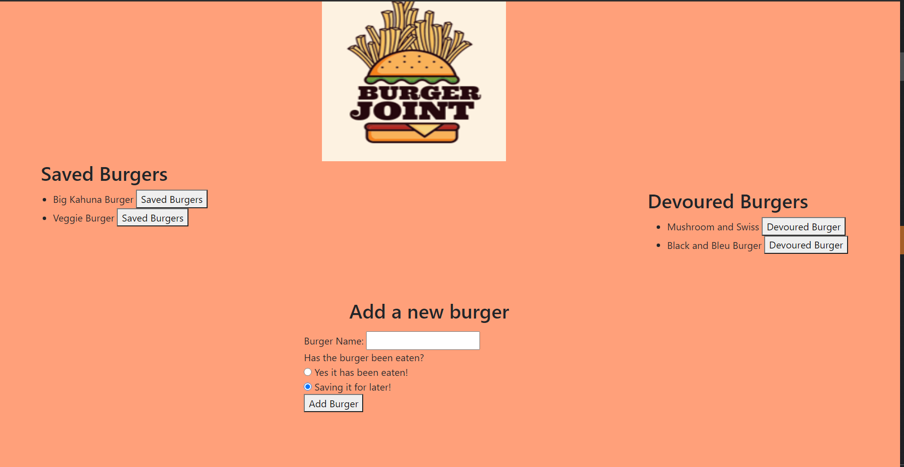

# make_and_eat_burger

## Table of Contents 

[Description](#description)

[Installation](#installation)

[Screenshots](#screenshots)

[Link to deployed app](#link)

[Questions](#questions)

## Description 

With this application, the user has a fun way of creating burgers they want to eat and can store it into one of the two tables. One of the tables is for burgers they are waiting to eat and the other table is for burgers they've already devoured. The user is first with a beautiful home screen with the 2 tables side to side  and a form to allow the user to create the name of the burger and whether they are saving to eat that burger for later or if it has already been devoured. 

## Installation 

To install the necessary dependencies, run the following command:

----------
npm i
----------

## Screenshots

## Link 
[Link to deployed Heroku app](https://secure-ridge-91792.herokuapp.com/)

## Questions 

If you have any questions about the repo, open an issue or contact me directly at mlavina91@gmail.com. 
You can find more of my work at (https://github.comLavina91/)